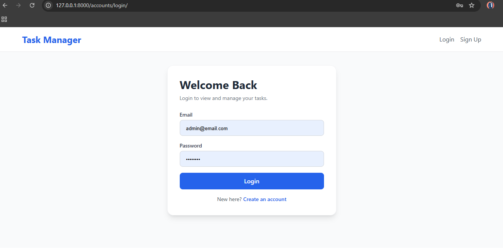
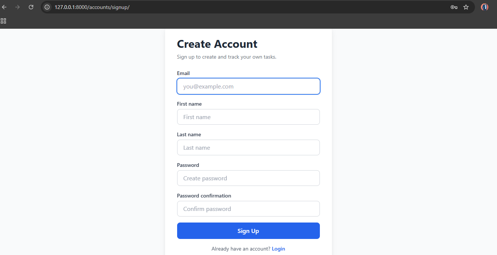
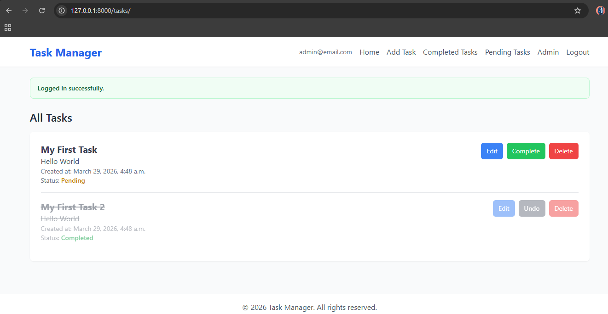
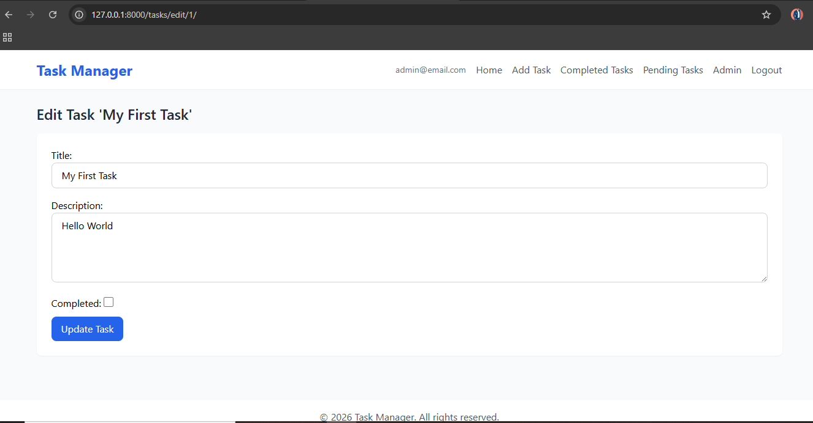
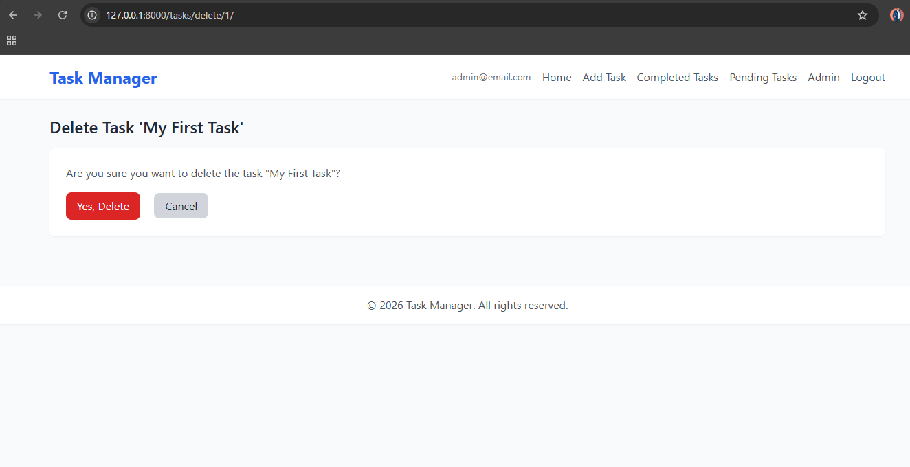
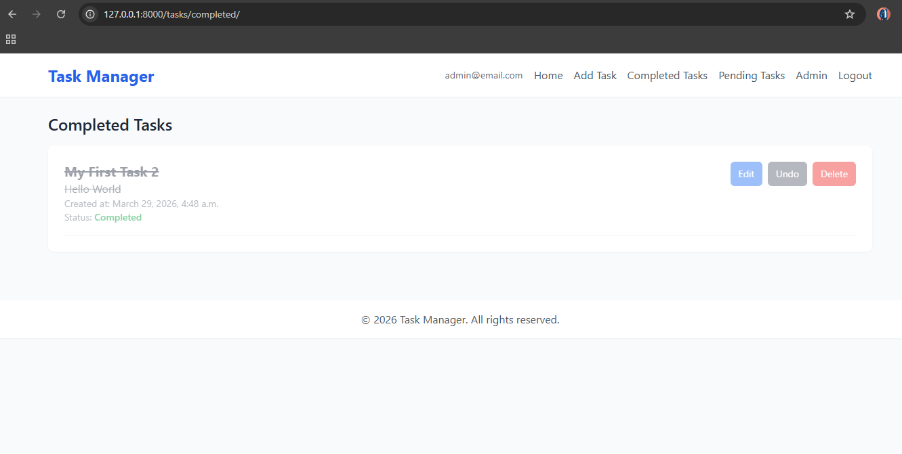
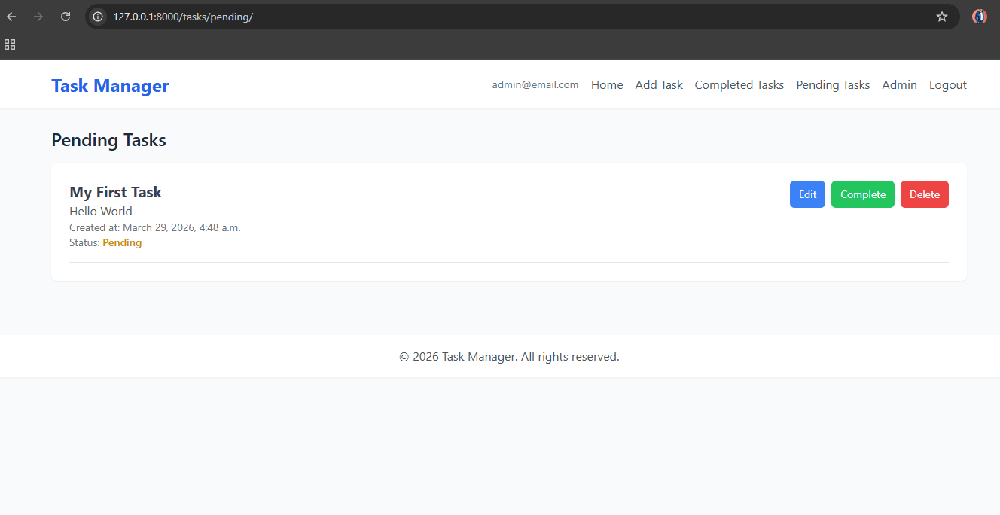
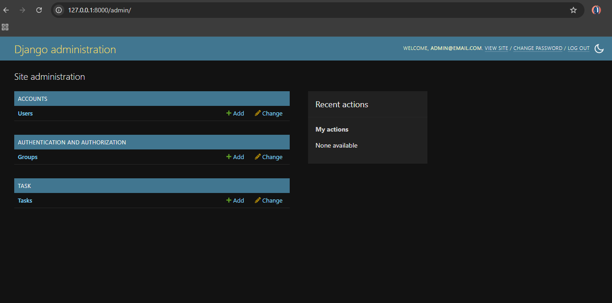
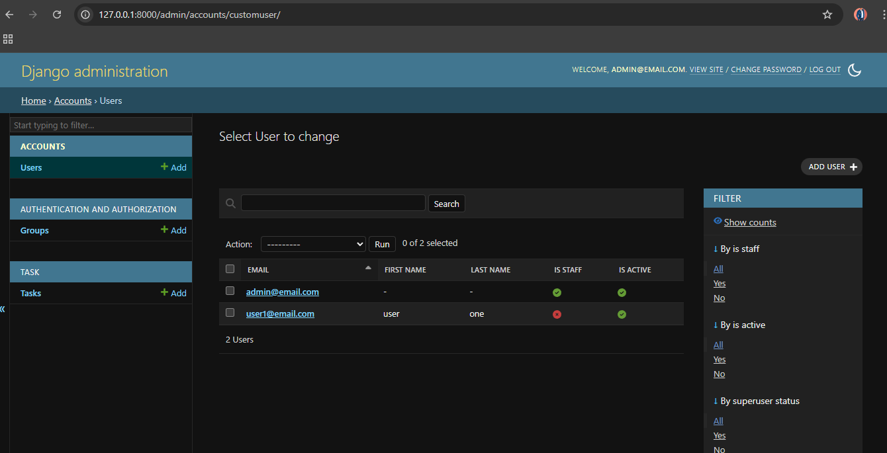
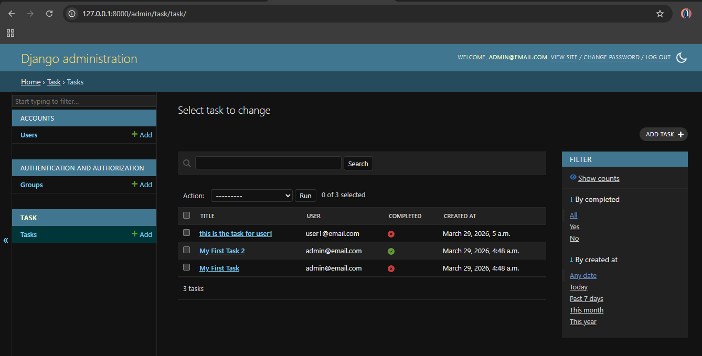

# Task Manager

Minimal Django task manager with email-based authentication and per-user task management.

## Features

- Custom user model with email as login identifier
- Signup, login, and logout flows
- Task CRUD
- Mark task as completed or pending
- Dedicated views for all, completed, and pending tasks
- User-scoped task access (users only see their own tasks)
- Django admin support

## Stack

- Python
- Django
- SQLite

## Local Setup

```bash
python -m venv venv
venv\Scripts\activate
pip install django
python manage.py migrate
python manage.py runserver
```

App runs at: http://127.0.0.1:8000/

## Main Routes

- `/` login page
- `/accounts/signup/` signup
- `/accounts/login/` login
- `/accounts/logout/` logout
- `/tasks/` task list
- `/tasks/add/` add task
- `/tasks/edit/<id>/` edit task
- `/tasks/toggle/<id>/` toggle completed/pending
- `/tasks/delete/<id>/` delete task
- `/tasks/completed/` completed tasks
- `/tasks/pending/` pending tasks
- `/admin/` Django admin

## Screenshots

### Login


### Signup


### Task List


### Edit Task


### Delete Task


### Completed Tasks


### Pending Tasks


### Admin Dashboard


### Admin Users


### Admin Tasks

